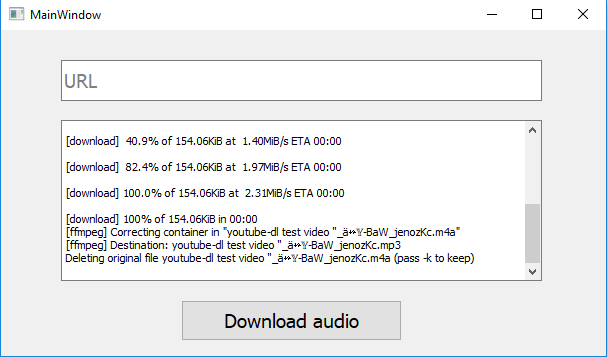

## Table of contents
* [General info](#general-info)
* [Technologies](#technologies)
* [Image](#image)

## General info
This program is a desktop app for downloading audio from diferent websites like youtube among others. The files are saved in the save directory that the program.

## Technologies
This project is created with:
* PyQt5
* youtube-dl

## Image

